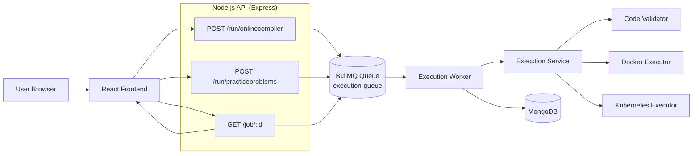
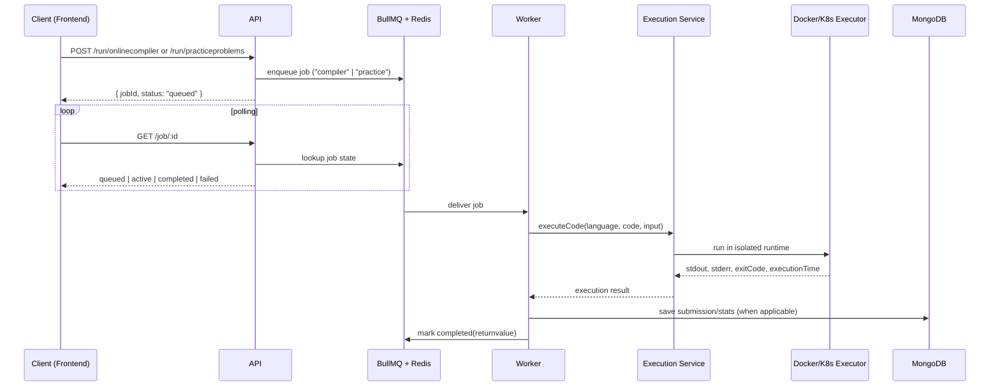
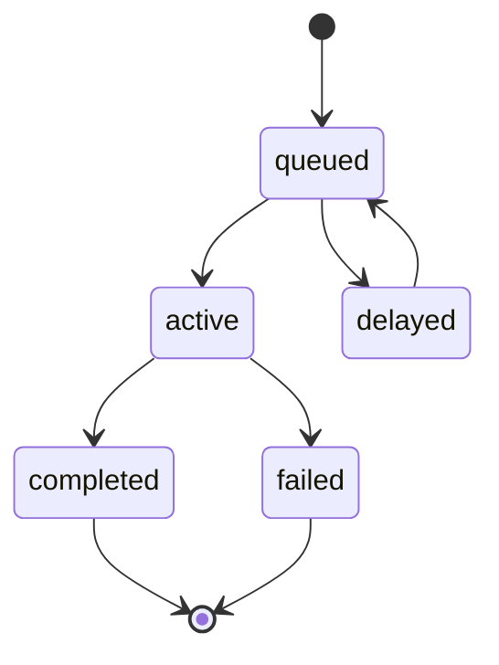
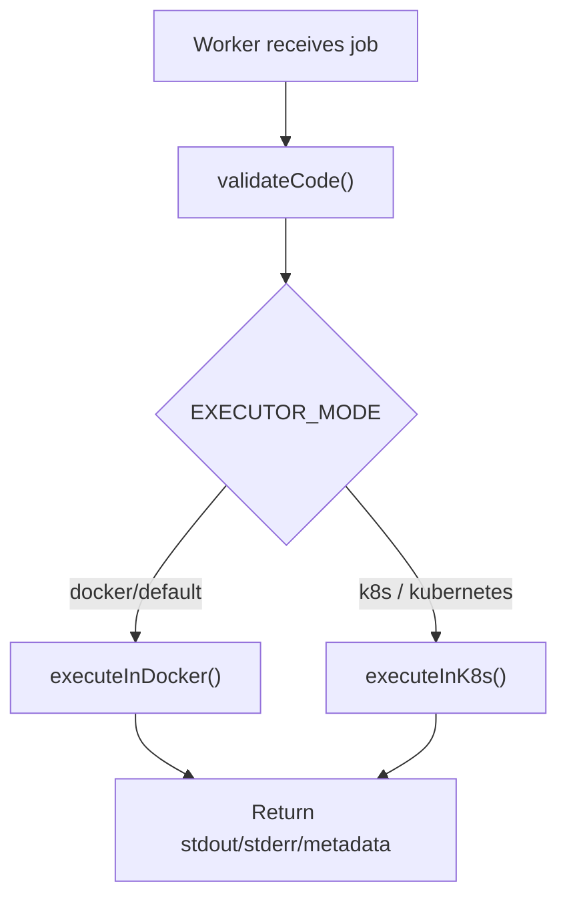

# CodeVault

CodeVault is a secure and scalable remote code-execution platform for:
- practicing coding problems
- running custom code in an online compiler
- tracking submissions and user progress

## Architecture 

### 1) System Overview



### 2) Request Lifecycle (Compiler / Practice)



### 3) Job State Model



### 4) Execution Path Decision



## Core Components

| Component | Responsibility |
|---|---|
| Frontend (React + Vite) | Code editor, problem-solving UI, job polling, result rendering |
| API (Express) | Accept submissions, enqueue jobs, expose job status, auth and app APIs |
| Queue (BullMQ + Redis) | Decouple request handling from execution workload |
| Worker | Consume queued jobs, execute code, persist results |
| Execution Service | Validate code and route to Docker or Kubernetes executor |
| MongoDB | Store users, submissions, problems, and user stats |

## Scalable Design

- API returns quickly with `jobId`; long-running execution happens asynchronously.
- Worker count can scale independently from API replicas.
- Redis queue absorbs traffic spikes.
- KEDA can autoscale workers based on queue backlog (`bull:execution-queue:wait`).

## Security Model 

### Static Validation
- Blocks risky patterns such as process spawning, shell escapes, and direct networking primitives.

### Docker Isolation
- Network disabled (`--network none`)
- Read-only filesystem
- `tmpfs` for temp files with limits
- PID and output constraints

### Kubernetes Hardening
- Non-root runtime
- `allowPrivilegeEscalation: false`
- Seccomp `RuntimeDefault`
- Execution deadline via `activeDeadlineSeconds`

## Tech Stack

- Frontend: React, Vite, Tailwind CSS, Monaco Editor, Redux Toolkit
- Backend: Node.js, Express, BullMQ, ioredis, Mongoose
- Infra: Docker, Kubernetes, KEDA, Redis, MongoDB

## Run Locally

1. Start infra:
```bash
docker compose up -d
```

2. Start backend:
```bash
cd backend
npm install
npm run dev
```

3. Start frontend:
```bash
cd frontend
npm install
npm run dev
```

4. Open app:
- `http://localhost:5173`

## Deploy on Kubernetes

1. Ensure your `kubectl` context points to your cluster.
2. Apply manifests:
```bash
kubectl apply -f k8s/
```
3. Verify:
```bash
kubectl get pods -n codevault-exec
```
